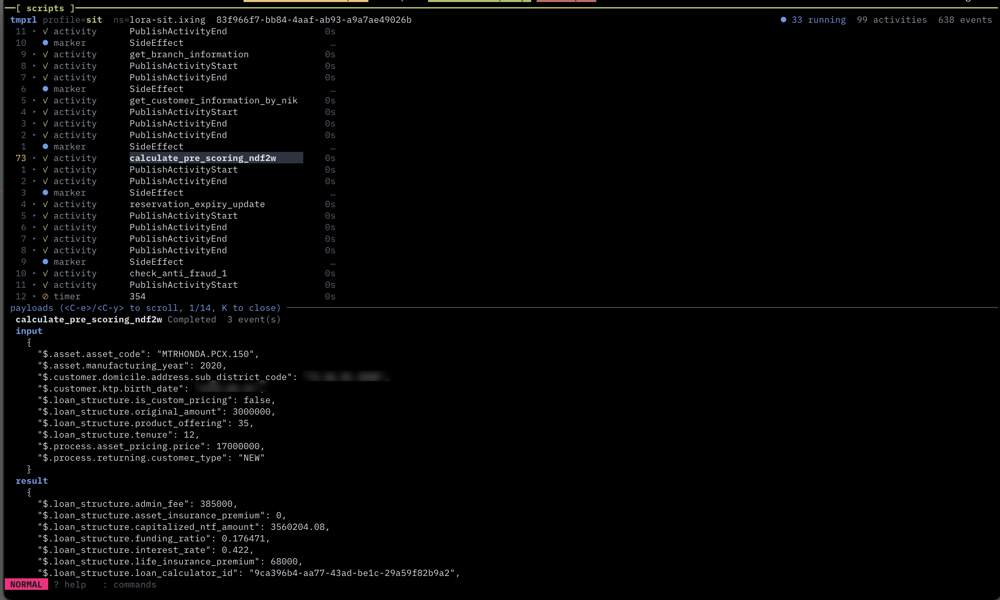
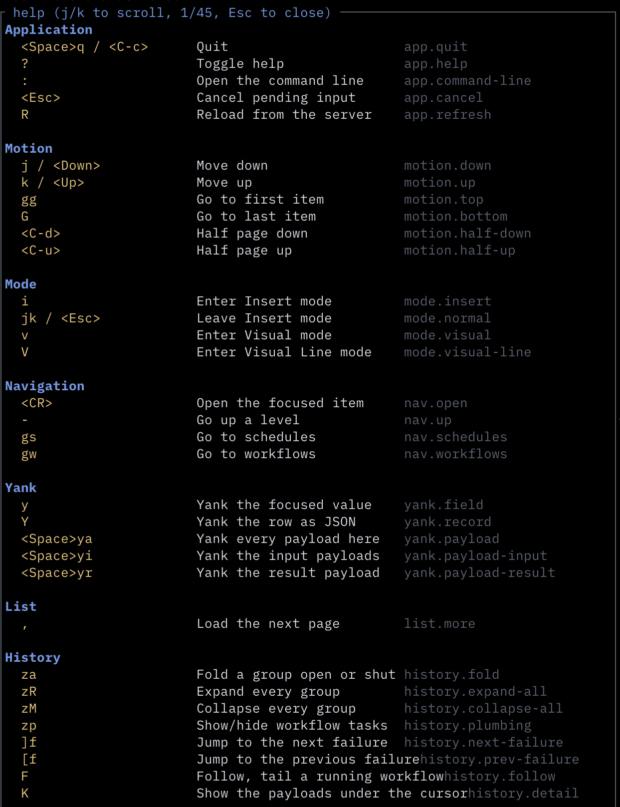
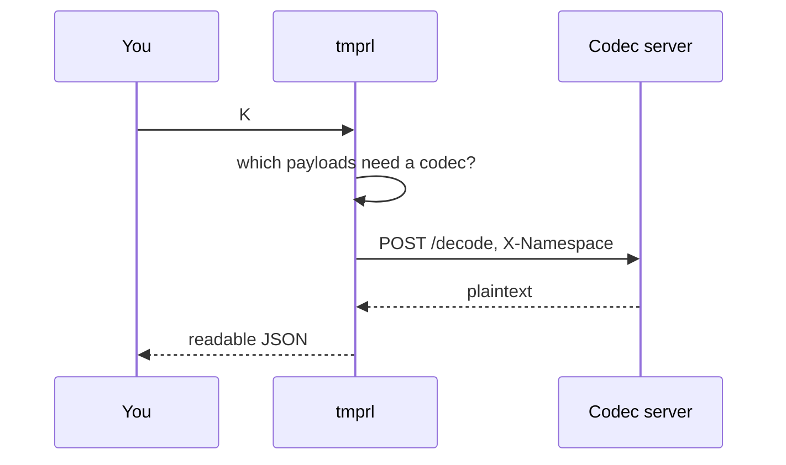
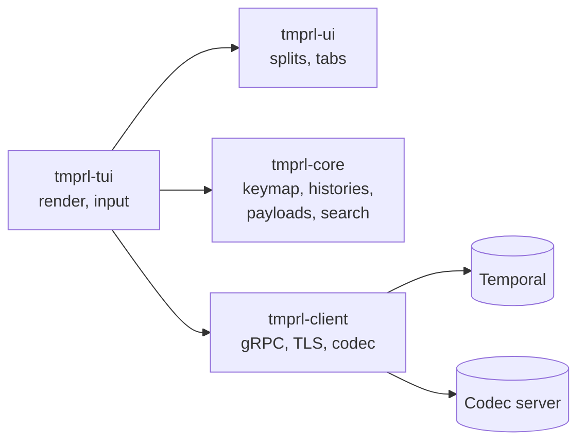

<h1 align="center">tmprl</h1>

<p align="center">A keyboard-driven terminal client for <a href="https://temporal.io">Temporal</a>.</p>

<p align="center">
  <a href="https://github.com/arisros/tmprl/actions/workflows/ci.yml"></a>
  
  
</p>



<sub>Real history on Temporal Cloud. Two customer values blurred, nothing else.</sub>

## Quickstart

```sh
brew install arisros/tap/tmprl
# or, on Linux and macOS
curl -LsSf https://github.com/arisros/tmprl/releases/latest/download/tmprl-installer.sh | sh
# or from crates.io; protoc is required, the protos build from source
cargo install tmprl

temporal server start-dev &
tmprl
```

```sh
tmprl --profile prod     # a profile from temporal.toml
tmprl --config-path      # every file tmprl reads, and whether it exists
```

## Keys



| | | | |
|---|---|---|---|
| `Enter` `-` | open / back | `/` `n` `N` | search |
| `i` `Enter` | edit / apply the query | `<Space>ff` | find a workflow |
| `V` | select rows | `<C-o>` `<C-i>` | jumplist |
| `za` `zR` `zM` | fold / expand / collapse | `zp` | show workflow tasks |
| `<Space>G` | timeline, like the web UI | `zg` | fold idle time |
| `]f` `[f` | next / previous failure | `F` | follow, like `tail -f` |
| `K` | payloads and the full failure | `!` | pipe them through `jq` |
| `y` `Y` | yank value / row | `<Space>y{a,i,r}` | yank payloads |
| `<Space>m…` | cancel, terminate, signal, delete, reset, update | `gs` `gw` | schedules / workflows |
| `<Space>s…` `<C-w>hjkl` | splits | `<Space>t…` | tabs |
| `<Space>T` | times as a clock or an age | `R` | reload from the server |
| `?` `:` | help / command line | `<Space>q` | quit |

Yank is OSC 52, so it reaches your clipboard through SSH; inside tmux it goes through
`tmux load-buffer -w`, which needs no tmux settings of your own. `?` and `:` are generated
from the command registry, so they cannot go stale. `keys.toml` rebinds anything.

## Payloads

Encrypted payloads decode in place, lazily, cached by ciphertext.



Any encoding tmprl cannot read itself is offered to the codec, not only Temporal's sample
`binary/encrypted`. A codec that refuses says why, on the badge.

## Mutations

Every destructive action shows the equivalent `temporal` CLI command before it runs, and is
appended to `~/.local/state/tmprl/audit.jsonl` with the profile and cluster address.

```
Terminate 3 workflows
  temporal workflow terminate --namespace prod --workflow-id order-1 --reason "…"
  type `3` to confirm   Esc to cancel
```

`V` a range first and the action applies to every selected row, one request each.

## Config

Connections come from the same file the `temporal` CLI uses. `tmprl --config-path` prints it.

```toml
# temporal.toml
[profile.prod]
address   = "my-ns.a1b2c.tmprl.cloud:7233"
namespace = "my-ns.a1b2c"
api_key   = "…"
```

```toml
# ~/.config/tmprl/config.toml
[layout]
payload = "right"         # K opens beside the list; "bottom" is the default

[profile.sit]
accent = "green"

[profile.prod]
accent   = "red"          # colours the profile name, bold too
readonly = true           # refuses every mutation, shown as prod [ro]

[profile.prod.codec]
endpoint = "https://codec.internal"
```

```toml
# ~/.config/tmprl/views.toml — <Space>1 … <Space>9
[[view]]
key   = "1"
name  = "Running now"
query = "ExecutionStatus = 'Running'"
```

## Layout



| Crate | Tests | |
|---|---|---|
| `tmprl-client` | 59 | all network IO |
| `tmprl-core` | 236 | no terminal, no server |
| `tmprl-tui` | 230 | ratatui |
| `tmprl-ui` | 37 | window tree |

```sh
cargo test                       # integration tests skip with no server
TMPRL_REQUIRE_SERVER=1 cargo test  # what CI runs
```

[docs/ARCHITECTURE.md](docs/ARCHITECTURE.md) · [docs/INTERFACE.md](docs/INTERFACE.md) · [docs/RELEASING.md](docs/RELEASING.md) · [CHANGELOG.md](CHANGELOG.md)

## Roadmap

- [x] workflows, visibility queries, saved views, multi-namespace
- [x] histories, follow mode, `jq`, codec server, splits and tabs
- [x] search, pickers, jumplist
- [x] mutations, schedules, batch over a selection
- [ ] server-side batch operations
- [ ] task queues, workers, deployments, nexus, archival
- [ ] diff, macros, headless `--exec`, themes

## Prior art

[`galaxy-io/tempo`](https://github.com/galaxy-io/tempo) works today and is finished; use it
if you need a Temporal TUI now. `tmprl` differs in aiming at full web-UI parity with a modal
editor model rather than a menu.

MIT. See [LICENSE](LICENSE).
