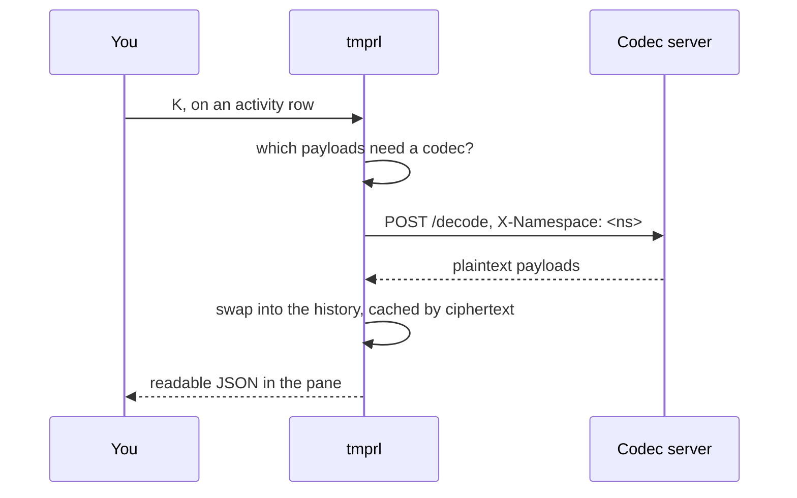
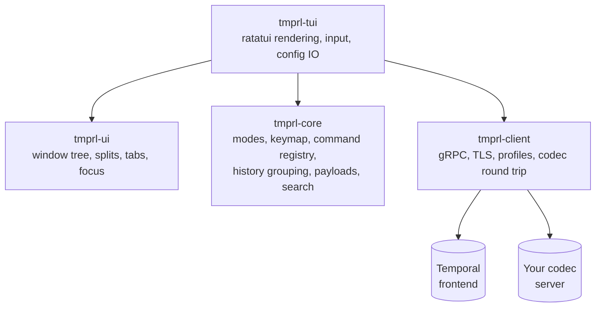

<h1 align="center">tmprl</h1>

<p align="center">
  A keyboard-driven terminal client for <a href="https://temporal.io">Temporal</a>.<br>
  Browse namespaces, workflows and histories, read encrypted payloads, and act on them,
  without leaving the terminal.
</p>

<p align="center">
  <a href="https://github.com/arisros/tmprl/actions/workflows/ci.yml"></a>
  
  
</p>

---

## What this is

The Temporal Web UI is good, but it is a browser: you cannot pipe a payload through `jq`,
you cannot yank a workflow id into your editor over SSH, and you cannot keep four
namespaces open in tmux panes.

`tmprl` is that client. It reads the same `temporal.toml` profiles the `temporal` CLI
reads, so if the CLI can reach your cluster, so can this. Everything is a vim binding, and
every binding is a named command you can rebind or call from `:`.

> [!NOTE]
> **Status: early, but genuinely usable.** Workflows, histories, schedules, mutations,
> search and payloads all work against local, self-hosted and Temporal Cloud clusters.
> Task queues, workers and nexus are not built yet. If you need a finished Temporal TUI
> today, see [Prior art](#prior-art).

Every binding, generated from the command registry so it cannot go stale:

<p align="center">
  
</p>

## Quickstart

```sh
# 1. protoc is required: Temporal's protobufs are compiled from source at build time
brew install protobuf            # or: apt-get install -y protobuf-compiler

# 2. build and install
cargo install --path crates/tmprl-tui

# 3. a server to talk to
temporal server start-dev

# 4. go
tmprl
```

Without `protoc` the build fails inside a build script with `Could not find protoc`, which
is easy to misread as a network problem. It isn't.

You land on the namespace list. `Enter` opens one, `Enter` again opens a workflow's
history, `K` shows its payloads, `?` lists every key, `<Space>q` quits.

```
 tmprl profile=default  ns=default                                        3 namespaces
   1 default                     Registered       1d
   2 payments                    Registered       3d
   1 temporal-system             Registered       7d

 NORMAL  ? help   : commands
```

Point it at something real with a profile name:

```sh
tmprl --profile prod          # from temporal.toml
tmprl --config-path           # prints every file tmprl reads, and whether it exists
```

## What it does

### Browsing

| | |
|---|---|
| Namespaces | one list, `V` to select several and open them as one merged table |
| Workflows | pages in as you scroll, newest first, per-status counts from one `GROUP BY` |
| Query bar | the raw visibility query, always on screen, `i` to edit, never hidden behind a widget |
| Saved views | `views.toml` on `<Space>1`–`<Space>9`, named in the which-key popup |
| Find | `/` `n` `N` to search, `<Space>f` pickers for workflows, events, panes and commands |
| Jumplist | `<C-o>` / `<C-i>`, recording jumps rather than every line moved |

### Reading a history

Events are folded into groups, so an activity that was scheduled, started and completed is
one row carrying its retry count and failure message, not three rows.

| | |
|---|---|
| `za` `zR` `zM` | fold one, expand all, collapse all |
| `zp` | reveal the workflow-task plumbing, hidden by default |
| `]f` `[f` | jump between failures, which is usually why you opened it |
| `F` | follow a running workflow like `tail -f`, stops itself when it closes |
| `K` | payloads for the row, decoded and pretty-printed |
| `!` | pipe those payloads through any command, pre-filled with `jq .` |

Only the visible rows are ever built, so a history with hundreds of thousands of events
scrolls by moving an index.

### Payloads and codecs

Encrypted payloads are decoded in place through your codec server, lazily and cached, so
everything else reads plaintext without knowing. A codec that refuses says why on the badge
rather than leaving a lock you cannot explain.



`tmprl` asks a codec about any encoding it cannot read itself, not only Temporal's sample
`binary/encrypted`, because a codec names its own output and real ones do.

### Acting on workflows

Cancel, terminate, signal, delete, reset and update, on `<Space>m{c,t,s,d,r,u}`. Each sits
behind one confirmation that **shows the equivalent `temporal` CLI command**, so you read
what is about to happen rather than trusting a verb.

`V` a range first and the action applies to every selected row, one request each. A
destructive batch asks for the count to be typed; delete always asks for the word `delete`.

Every attempt, successful or not, is appended to `~/.local/state/tmprl/audit.jsonl` with
the profile and cluster address, because a namespace name is not unique across
environments.

Schedules live on `gs` (`gw` goes back), with create, pause, resume, trigger, delete and
backfill behind the same confirmation.

### Getting things out

| | |
|---|---|
| `y` / `Y` | the focused value, or the row as JSON |
| `<Space>ya` `yi` `yr` | every payload here, just the inputs, just the result |
| `!jq . > /tmp/x.json` | anything too big for a clipboard |

Yanking uses **OSC 52**, so it reaches the clipboard on the machine you are sitting at even
through SSH and tmux. A single payload is yanked unwrapped, ready to paste; several keep
their labels so `input[0]` and `input[1]` stay apart.

### Working across environments

Splits and tabs use vim's bindings: `<Space>sv` / `<Space>sh` to split, `<C-w>hjkl` to
move, `<Space>t{o,x,n,p}` for tabs. Each pane keeps its own screen, cursor, query and
history.

Per-profile settings keep production distinguishable from staging, and stop you mutating it
by accident. See [Several environments](#several-environments).

## Configuration

`tmprl` has no connection config of its own: it reads the profiles the `temporal` CLI
reads. `tmprl --config-path` prints which files it found.

```toml
# temporal.toml — ~/.config/temporalio on Unix,
# ~/Library/Application Support/temporalio on macOS
[profile.prod]
address   = "my-ns.a1b2c.tmprl.cloud:7233"
namespace = "my-ns.a1b2c"
api_key   = "…"

[profile.staging.tls]
client_cert_path = "/etc/temporal/client.pem"
client_key_path  = "/etc/temporal/client.key"
```

Precedence follows the CLI: flags, then `TEMPORAL_*` environment variables, then the file.

Everything else lives in `$TMPRL_CONFIG_DIR`, else `$XDG_CONFIG_HOME/tmprl`, else
`~/.config/tmprl`. All three files are optional:

```toml
# views.toml — saved queries on <Space>1 … <Space>9
[[view]]
key   = "1"
name  = "Running now"
query = "ExecutionStatus = 'Running'"
```

```toml
# keys.toml — chord → command id, overriding the defaults
[normal]
"ZZ"    = "app.quit"
"<C-r>" = "app.refresh"
```

Command ids are the ones `?` and `:` show. An unknown id, an unparseable chord or a
duplicate view key is reported at startup rather than quietly skipped.

### Several environments

`config.toml` keys settings by profile name, so one cluster cannot be mistaken for another:

```toml
[codec]                        # any profile that names no codec of its own
endpoint = "http://localhost:8081"

[profile.sit]
accent = "green"

[profile.prod]
accent   = "red"               # paints the profile name in the statusline
readonly = true                # refuses every mutation, shown as prod [ro]

[profile.prod.codec]           # overrides the codec above, for prod only
endpoint = "https://codec.internal"
auth     = "Bearer …"
```

`accent` is one of red, green, yellow, blue, magenta or cyan, and renders bold as well as
coloured, since colour alone does not survive a 16-colour terminal or a colour-blind
reader. `readonly` refuses mutations at the keystroke and again at the wire.

Omitting a codec for an environment is a legitimate choice: a profile with none renders
encrypted payloads as a badge saying one is needed, which is what you want for a cluster
whose keys should not be on your machine.

## How it works



| Crate | Holds | Tests |
|---|---|---|
| `tmprl-client` | all network IO: gRPC, TLS, codec, profiles | 59 |
| `tmprl-core` | domain logic with no terminal and no server | 236 |
| `tmprl-tui` | ratatui rendering and input | 230 |
| `tmprl-ui` | window tree, splits, tabs, focus | 37 |

The split exists so the hard logic, reconstructing histories, compiling visibility queries,
diffing runs, lands in a layer that needs neither a terminal nor a server to test. The
architecture is written down in **[docs/ARCHITECTURE.md](docs/ARCHITECTURE.md)** and the
interface design in **[docs/INTERFACE.md](docs/INTERFACE.md)**.

## Building and testing

```sh
cargo build                       # debug info is off; use --profile dbg for a debugger
temporal server start-dev &
cargo test
```

Integration tests **skip** when no server is reachable, so `cargo test` stays green on a
machine that has never run Temporal. `TMPRL_REQUIRE_SERVER=1` turns that skip into a
failure, which CI sets, so a broken connection layer cannot pass as a green build.

There is also a non-interactive example for checking connectivity without the interface:

```sh
cargo run -p tmprl-client --example spike [profile]
```

## Roadmap

- [x] **M0a** gRPC layer, profile loading, integration tests
- [x] **M0b** event loop, command registry, modal keymap, statusline, which-key, yank
- [x] **M1** workflow list, visibility queries, saved views, multi-namespace, `keys.toml`
- [x] **M2** history views, follow mode, jq, codec server, splits and tabs
- [x] **M2b** finding: `/` search, the `<leader>f` pickers, jumplist, `$EDITOR`, problem list
- [x] **M3** mutations: signal, cancel, terminate, delete, reset, update
- [x] **M4** schedules: list, create, pause, trigger, delete, backfill
- [ ] **M5** batch operations: over a selection *(done)*; server-side query batches remain
- [ ] **M6** task queues, workers, deployments, nexus, archival
- [ ] **M7** diff, macros, headless `--exec`, themes

M2's "Finding" section was specified in [docs/INTERFACE.md](docs/INTERFACE.md) but never
built, so it is broken out as **M2b** rather than quietly folded into the M2 tick above.
Still open from it: `<leader>P` connection profiles, `<leader>-` object browser, and
`<leader>cs` / `<leader>cq` workflow queries. Editing an existing schedule is also not built.

## Prior art

[`galaxy-io/tempo`](https://github.com/galaxy-io/tempo) is a Go/tview Temporal TUI that
works today: browsing, history, cancel/terminate/signal, schedules, themes. If you need a
terminal Temporal client right now, use that one.

`tmprl` differs in intent: full web-UI parity including batch operations, nexus, worker
deployments, reset and codec servers, and a modal editor model rather than a menu. Whether
that difference is worth a second implementation is a fair question, and the answer isn't
in yet.

## Contributing

The four rules in [docs/ARCHITECTURE.md](docs/ARCHITECTURE.md#10-design-rules) are the ones
worth reading before writing code. Issues and discussion welcome; given the stage, design
feedback is more useful than patches.

## License

MIT. See [LICENSE](LICENSE).
